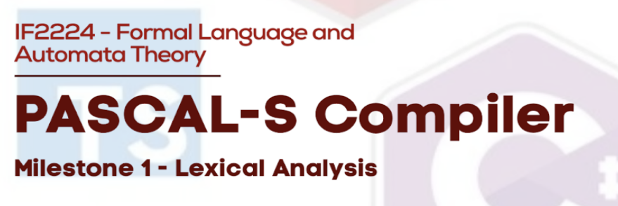

# HJE-Tubes-IF2224 | Pascal-S Lexical Analyzer (Milestone 1)



## Identitas Kelompok

```
- Sebastian Enrico Nathanael (13523134)
- Jonathan Kenan Budianto (13523139)
- Mahesa Fadhillah Andre (13523140)
- Muhammad Farrel Wibowo (13523153)
```

## Deskripsi Program

Lexer (lexical analyzer) sederhana untuk subset Pascal-S. Program ini membaca file sumber Pascal-S dan melakukan analisis leksikal menggunakan DFA yang didefinisikan pada `src/dfa_rules.json`, dan mengeluarkan daftar token dalam format `TYPE(value)`.

Mekanisme program:
Program ini mengimplementasikan logika DFA yang dimuat dari `src/dfa_rules.json`. Lexer lalu akan melakukan scanning huruf demi huruf dan menerapkan prinsip greedy match untuk memilih lexeme yang valid. Dengan logika fallback untuk mengidentifikasi dan membedakan keywords dan operator kata seperti mod, and dari identifier yang didefinisikan.

Program ini menghandle komen dan mengabaikannya. Semua whitespace dan dua komentar ((*..*), {..}) diabaikan.

Error handling sudah diimplementasikan, mampu mendeteksi dan menghasilkan output semantic ketika menemukan simbol yang tidak dikenali.

## Cara Instalasi dan Penggunaan Program

### Requirement

- Python 3.8+

coba cek instalasi python dengan perintah
```
python --version / python3 --version
```

Jika belum terinstal, coba instal python dengan cara :

Windows :
- Kunjungi website resmi python: https://www.python.org/downloads
- Lalu unduh sesuai kebutuhan

Linux :
```
# Update package list
sudo apt update

# Install Python 3 dan development tools
sudo apt install python3 python3-pip
```
### Menjalankan lexer

Jalankan dari Terminal (Windows)

```
python src/compiler.py test/milestone-1/input/[nama_file_testing].pas
```

Linux
```
python3 src/compiler.py test/milestone-1/input/[nama_file_testing].pas
```

Hasil token akan disimpan di `test/milestone-1/output/output-<n>.txt`.

## Pembagian Tugas

| Nama                       |   NIM    |                    Pembagian Tugas |
| :------------------------- | :------: | ---------------------------------: |
| Sebastian Enrico Nathanael | 13523134 | Implementasi code, DFA, testing, Laporan     |
| Jonathan Kenan Budianto    | 13523139 | Implementasi code, DFA, testing              |
| Mahesa Fadhillah Andre     | 13523140 | Implementasi DFA, testing, Laporan           |
| Muhammad Farrel Wibowo     | 13523153 | Implementasi DFA, Pembuatan Diagram, testing | 
